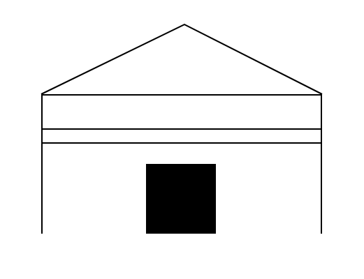
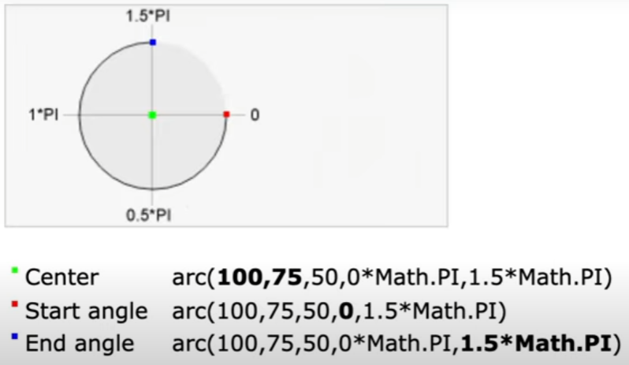
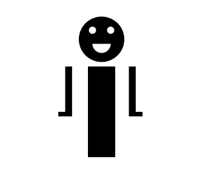
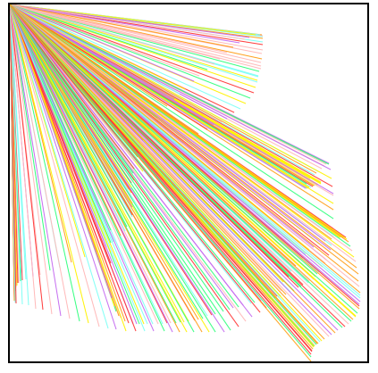
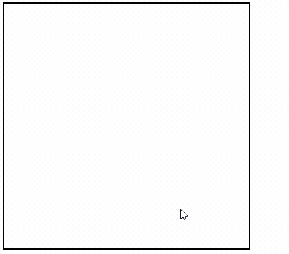

# Painting & Meme maker
## Info
바닐라 JS를 이용하여 그림판과 밈 메이커를 만들어봅시다!

## Study
### 1.0 The Power of Canvas
#### canvas란 무엇일까?
- canvas API는 우리가 Javascript로 그래픽을 그릴 수 있게 해주는 API.
- 3D 그래픽을 생각한다면 WebGL API가 매우 cool.
- 2D 그래픽에서는 canvas가 cool.

### 1.1 Our First Drawing
#### context?
- canvas에 그림을 그리기 위한 붓이라고 생각하면 된다.
```jsx
const ctx = canvas.getContext("2d") // 2d면 "2d" 3d는 "webgl" / "bitmaprenderer"
```

#### size
- canvas의 크기 값은 css 에서만 설정해 주는 것이 아니라, javascript에도 명시를 해주어야한다.
```jsx
canvas.width = 800;
canvas.height = 800;
```
- 선들을 그리기 시작할때, width와 height의 수정은 javascript에서만 진행한다.
  - 이유는? canvas에서 이미지의 퀄리티를 높이기 위해서이다.

#### canvas의 좌표 시스템
- left:0, top:0 이 좌표 (0, 0)

#### `fillRect()` 함수
- `fillRect()` 함수는 함수 이름처럼 사각형을 채우는 함수이다.
  - `fillRect(x, y, 너비, 높이)`

### 1.2 Paths
#### fill / stroke
- 사용했던 `fillRect()` 함수는 단축 함수이다. (위치를 그리고 바로 채워넣음)
- 먼저 위치를 그리고, 선으로 사용할 것인지 채울 것인지 다음과 같이 사용할 수도 있다.
```jsx
// 선만 그릴 경우
ctx.rect(50, 50, 100, 200);
ctx.stroke()

// 채우기로 사용할 경우
ctx.rect(50, 50, 100, 200);
ctx.fill()
```

- 여러개가 있어도 마찬가지이다.
```jsx
ctx.rect(50, 50, 100, 100);
ctx.rect(150, 150, 100, 100);
ctx.rect(250, 250, 100, 100);
ctx.stroke()
```
- 주의할 점은 `fill()` / `stroke()` 설정 이후에 오는 `rect()`는 다시 적용을 해주어야 한다는 점이다. 

#### path
- 다음의 경우에서 예상되는 값은 맨 마지막의 요소만 빨간색으로 `fill()`이 적용될 것을 예상할 수 있다.
- 왜냐하면 앞선 `fill()` 이후에 오는 값은 다시 `fill()`을 적용해주어야만 채워지기 때문이다.
```jsx
ctx.rect(50, 50, 100, 100);
ctx.rect(150, 150, 100, 100);
ctx.rect(250, 250, 100, 100);
ctx.fill();
ctx.rect(350, 350, 100, 100);
ctx.fillStyle = "red";
ctx.fill();
```
- 하지만 결과 값은 전부 빨간색으로 채워지게 된다.
- 이는 나머지의 `rect(...)`와 새로 설정해준 `rect(350, 350, 100, 100)`이 전부 동일한 path 값을 갖고 있기 때문이다.
- 다음처럼 수정하면 우리가 예상한 값을 가질 수 있다.
```jsx
ctx.rect(50, 50, 100, 100);
ctx.rect(150, 150, 100, 100);
ctx.rect(250, 250, 100, 100);
ctx.fill();

ctx.beginPath(); // 새 경로 생성
ctx.rect(350, 350, 100, 100);
ctx.fillStyle = "red";
ctx.fill();
```
- `beginPath()` 함수를 이용하게되면, 이전의 그림들의 path와 다른 새로운 path 값을 생성해주게된다.
- 이전 경로와는 완전 단절, 새로운 경로가 생성되는 것이다.

### 1.3 moveTo and lineTo
#### rect()
- `rect()` 함수도 사실 shortcut function 이었다.
- 그렇다면 `rect()`를 사용하지 않고 직접 작성하려면 어떻게 하면 될까?

#### moveTo() / lineTo()
- `moveTo()`는 시작 지점을 이동해주는 함수
  - `moveTo(x, y)`
  - 연필의 위치를 옮김
- `lineTo()`는 선을 그리면서 이동해주는 함수
  - `lineTo(x, y)`
  - 연필로 그림을 그림
- x, y 좌표가 50, 50 떨어진 지점에서 정사각형을 그리고 싶다면?
```jsx
  ctx.moveTo(50, 50);
  ctx.lineTo(150, 50);
  ctx.lineTo(150, 150);
  ctx.lineTo(50, 150);
  ctx.lineTo(50, 50)
  ctx.stroke(); // 채우고 싶다면 fill()
```

### 1.4 Drawing Project One
- 지금까지 배운 걸로 집을 한번 그려보자

#### lineWidth
- 선 굵기를 조절하려면 `lineWidht`를 사용하면 된다.
- 이 때 주의할 점은 `lineWidth` 가 적용될 그림의 이전에 선언되어야 한다는 것이다.
```jsx
// X
ctx.strokeRect(300, 300, 50, 100);
ctx.lineWidth = 20; 

// O
ctx.lineWidth = 20; 
ctx.strokeRect(300, 300, 50, 100); 
```

#### house
- 만들어본 house
```jsx
ctx.fillRect(200, 200, 2, 200); // 왼쪽 벽
ctx.fillRect(600, 200, 2, 200); // 오른쪽 벽
ctx.lineWidth = 2; // 선 굵기 조절
ctx.moveTo(202, 250); // 벽 장식 1 선 그릴 위치로 이동
ctx.lineTo(602, 250); // 벽 장식 1
ctx.moveTo(202, 270); // 벽 장식 2 선 그릴 위치로 이동
ctx.lineTo(602, 270); // 벽 장식 2
ctx.fillRect(350, 300, 100, 100); // 문
ctx.fillRect(200, 200, 402, 2); // 천장
ctx.moveTo(200, 200); // 지붕 그릴 위치로 이동
ctx.lineTo(405, 100); // 왼쪽 지붕
ctx.lineTo(602, 200); // 오른쪽 지붕
ctx.stroke(); // 선 채우기
```


### 1.5 Drawing Project Two
- 이번엔 사람을 그려보자
- 사람에게 가장 중요한 것은? 머리

#### arc()
- `arc()` 는 원을 그려주는 함수
  - `arc(x, y, radius, startAngle, endAngle, counterclockwise?)`
  - endAngle 의 값을 조절해주면 반원 등을 만들 수 있음
    ```jsx
    ctx.arc(250, 50, 50, 0, 2 * Math.PI); // 원
    ctx.arc(250, 50, 50, 0, 1 * Math.PI); // 반원
    ```
  - angle 관련 자료
    

#### cute man
- cute man
```jsx
ctx.fillRect(210 - 40, 200 - 40, 15, 100); // 왼팔
ctx.fillRect(195 - 40, 300 - 40, 30, 10); // 왼손
ctx.fillRect(350 - 40, 200 - 40, 15, 100); // 오른팔
ctx.fillRect(350 - 40, 300 - 40, 30, 10); // 오른손
ctx.fillRect(260 - 40, 200 - 40, 60, 200); // 몸통

ctx.arc(250, 100, 50, 0, 2 * Math.PI); // 머리
ctx.fill();

ctx.beginPath(); // 새로운 path
ctx.fillStyle = "#fff";
ctx.arc(260 + 10, 80, 8, 0, 2 * Math.PI); // 눈
ctx.arc(220 + 10, 80, 8, 0, 2 * Math.PI); // 눈
ctx.fill();

ctx.beginPath(); // 새로운 path
ctx.arc(250, 110, 20, 0, 1 * Math.PI); // 귀여운 입
ctx.fill();
```


### 2.0 Painting Lines
- 그림판 프로토타입을 제작해보자
- 일단 1차적 목표는 클릭하면 선을 그릴 수 있게 만들어 보는 것!

#### addEventListener("click")
- 클릭시 이벤트를 만들어주기 위해서 `addEventListener("click", function)` 을 사용하여 클릭이벤트를 생성해준다.

#### addEventListener("mousemove")
- 클릭 말고 마우스에 따라서 그려지기 위해서는 `addEventListener("mousemove", function)` 을 사용해주면 된다.

#### 기본 결과물
- 좌표값(0, 0) 에서 각각 다른 색의 선이 마우스오버에 따라 그려지는 그림판
```jsx
ctx.lineWidth = 2;

const colors = [
  "#ff3838",
  "#ffb8b8",
  "#c56cf0",
  "#ff9f1a",
  "#fff200",
  "#32ff7e",
  "#7efff5",
];

function onClick(event){
  ctx.beginPath(); // 새 선을 그릴 때 마다 새로운 컬러를 주기 위해서 새로운 path 생성
  ctx.moveTo(0, 0); // 최상단 맨 왼쪽
  const color = colors[Math.floor(Math.random() * colors.length)]; // color 배열에서 랜덤 컬러 값 가져오기
  ctx.strokeStyle = color; // 해당 배열에서 가져온 값 적용
  ctx.lineTo(event.offsetX, event.offsetY); // 해당 클릭 지점의 x, y 좌표
  ctx.stroke(); // 선 그려주기
}

canvas.addEventListener("mousemove", onClick);
```


### 2.1 Mouse Painting
- 마우스가 눌려있는 채로 움직일 때부터 손가락을 뗄 때까지(드래그 한 영역) 그리는 그림판
- 작동
  - 유저가 canvas 위에서 마우스를 움직일 때 마다 `moveTo()`(이동만 시켜주는 함수) 호출 (유저가 클릭하고 움직일 때, 연필로 그림을 그려야 함)

#### addEventListener("mousedown")
- 마우스를 누르고 있는 상태의 이벤트

#### addEventListener("mouseup")
- 마우스를 뗀 상태의 이벤트

#### 1차 완성작
```jsx
let isPainting = false;

function onMove(event) {
  if(isPainting){ // 만약 그림을 그리기 시작(mousedown) 했다면?
    ctx.lineTo(event.offsetX, event.offsetY);
    ctx.stroke();
    return;
  }
  ctx.moveTo(event.offsetX, event.offsetY); // 유저 마우스가 캔버스 내에 있는 위치로 움직이기
}
function onMouseDown(){ // 마우스를 누를 때 함수
  isPainting = true;
}
function onMouseUp(){ // 마우스를 뗄 때 함수
  isPainting = false;
}

canvas.addEventListener("mousemove", onMove);
canvas.addEventListener("mousedown", onMouseDown); // 마우스를 누르고 있는 상태
canvas.addEventListener("mouseup", onMouseUp); // 마우스를 뗀 상태
```
- 한가지 버그가 존재함. canvas 바깥으로 나갈 때까지 마우스를 누르고 있게 되면, 다시 canvas 내부로 돌아왔을 때 계속 그려짐
- 이유는 다음과 같다.
  - mousedown 상태로 canvas 바깥으로 나갔기 때문에 mouseup 이 적용이 안됨
  - 자연스럽게 `onMouseUp()` 이 실행되지 않았고, isPainting도 true 상태로 머물러 있음

#### fix bug
- 첫번째 방법
  - `addEventListener("mouseleave", onMouseUp)`
  - 다음의 방식을 추가해주면 canvas 바깥으로 빠져 나왔을 때 `onMouseUp()`을 호출하여 `isPainting = false`를 만들어 주어 버그를 해결해 줄 수 있다.
- 두번째 방법
  - `canvas.addEventListener("mouseup", onMouseUp)`을
  - `document.addEventListener("mouseup", onMouseUp)`로 수정해준다.
  - 다음의 방식을 사용하게 되면, canvas에서 한정된 것이 아니라 문서 어디에서든지 마우스에서 손을 떼면 `isPainting = false` 가 된다.
- 본 강의에선 **첫번째 방법**을 선택하였다.
- 버그 픽스 후 최종 결과물
```jsx
const canvas = document.querySelector("canvas");
const ctx = canvas.getContext("2d");
canvas.width = 800;
canvas.height = 800;
ctx.lineWidth = 2;
let isPainting = false;

function onMove(event) {
  if(isPainting){ // 만약 그림을 그리기 시작(mousedown) 했다면?
    ctx.lineTo(event.offsetX, event.offsetY);
    ctx.stroke();
    return;
  }
  ctx.moveTo(event.offsetX, event.offsetY); // 유저 마우스가 캔버스 내에 있는 위치로 움직이기
}
function startPainting(){ // 마우스를 누를 때 함수
  isPainting = true;
}
function cancelPainting(){ // 마우스를 뗄 때 함수
  isPainting = false;
}

canvas.addEventListener("mousemove", onMove);
canvas.addEventListener("mousedown", startPainting); // 마우스를 누르고 있는 상태
canvas.addEventListener("mouseup", cancelPainting); // 마우스를 뗀 상태
canvas.addEventListener("mouseleave", cancelPainting); // canvas 바깥으로 마우스가 나갔을 때, cancelPainting() 호출
```


### 2.2 Line Width
- 그림판 선의 굵기를 수정해보자
#### input
- 선 굵기를 조절하기 위한 input 생성
```html
<input id="line-width" type="range" min="1" max="20" value="5" step="0.1">
```
  - `type="range"` 범위 input
  - `min="1"` 최소 1
  - `max="20"` 최대 20
  - `value="5"` 처음 설정 값
  - `step="0.1"` 한번에 이동하는 값

#### 선 굵기 조절하기
```jsx
const lineWidth = document.getElementById("line-width"); // input range
ctx.lineWidth = lineWidth.value; // input range의 value

function onLineWidthChange(event){ // input의 range가 변경되면 실행되는 함수
  ctx.lineWidth = event.target.value; // linewidth 를 input range에서 변경된 값으로 넣어주자
}

lineWidth.addEventListener("change", onLineWidthChange); // input range가 변경되었을 때
```
- 먼저 `document.getElementById()`를 이용하여 input range를 받아온다.
- `ctx.lineWidth` 에 input range의 value를 할당해준다.
- input range가 변경되었을 때, 이벤트리스너로 변경 값을 감지, 감지가 변경되면 실행될 `onLineWidthCange(event)` 함수를 생성해주어, lineWidth의 값을 input range에서 변경된 값으로 다시 넣어준다.

#### beginpath()
- 상단의 선 굵기 조절하기만 추가하게되면, 선 굵기를 조절할 때마다 이전에 그렸던 선들도 같이 굵기가 조절된다.
- 이를 위해 만들어 두었던 `onMove()` 함수에 다음과 같이 `ctx.beginpath()`를 추가해주면 매번 다시 그릴때마다 새로운 path가 생성된다.
```jsx
function onMove(event) {
  if(isPainting){ // 만약 그림을 그리기 시작(mousedown) 했다면?
    ctx.lineTo(event.offsetX, event.offsetY);
    ctx.stroke();
    return;
  }
  ctx.beginPath(); // 한번 그리기가 끝나면 새로운 path
  ctx.moveTo(event.offsetX, event.offsetY); // 유저 마우스가 캔버스 내에 있는 위치로 움직이기
}
```

## reference
[바닐라 JS로 그림 앱 만들기 2022](https://nomadcoders.co/javascript-for-beginners-2)
